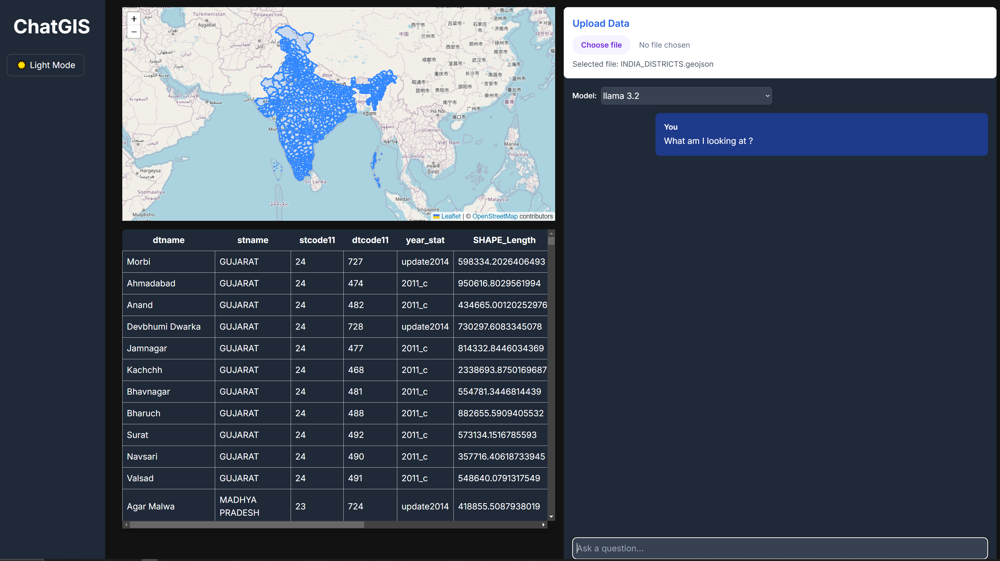

# ChatGISx


This is a [Next.js](https://nextjs.org) project bootstrapped with [`create-next-app`](https://nextjs.org/docs/app/api-reference/cli/create-next-app).

## Project Folder Structure

```
├── app/                    # Main application directory
│   ├── api/                # API routes
│   ├── globals.css         # Global styles
│   ├── layout.tsx          # Root layout component
│   ├── page.tsx            # Root page component
│   └── providers.tsx       # App providers
├── components/             # React components
│   ├── Chat/               # Chat related components
│   ├── DataView/           # Data visualization components
│   ├── FileUpload/         # File upload components
│   ├── Map/                # Map related components
│   └── ui/                 # Shared UI components
├── lib/                    # Utility functions and libraries
│   ├── db/                 # Database related code
│   ├── ollama/             # Ollama client
│   └── utils/              # Helper functions
├── public/                 # Static files
├── store/                  # State management
├── .env                    # Environment variables
├── .gitignore              # Git ignore file
├── next.config.js          # Next.js configuration
├── package.json            # Project dependencies and scripts
├── README.md               # Project documentation
├── tailwind.config.ts      # Tailwind configuration
└── tsconfig.json           # TypeScript configuration
```

## Getting Started

### Install the required dependencies in `package.json` by running,

```sh
npm install
```

### Run the development server:

```bash
npm run dev
# or
yarn dev
# or
pnpm dev
# or
bun dev
```

### Open the app

- [http://localhost:3000](http://localhost:3000) with your browser to see the result.

### Edit the app page

You can start editing the page by modifying `app/page.tsx`. The page auto-updates as you edit the file.

This project uses [`next/font`](https://nextjs.org/docs/app/building-your-application/optimizing/fonts) to automatically optimize and load [Geist](https://vercel.com/font), a new font family for Vercel.

## Learn More

To learn more about Next.js, take a look at the following resources:

- [Next.js Documentation](https://nextjs.org/docs) - learn about Next.js features and API.
- [Learn Next.js](https://nextjs.org/learn) - an interactive Next.js tutorial.

You can check out [the Next.js GitHub repository](https://github.com/vercel/next.js) - your feedback and contributions are welcome!

## Deploy on Vercel

The easiest way to deploy your Next.js app is to use the [Vercel Platform](https://vercel.com/new?utm_medium=default-template&filter=next.js&utm_source=create-next-app&utm_campaign=create-next-app-readme) from the creators of Next.js.

Check out our [Next.js deployment documentation](https://nextjs.org/docs/app/building-your-application/deploying) for more details.
